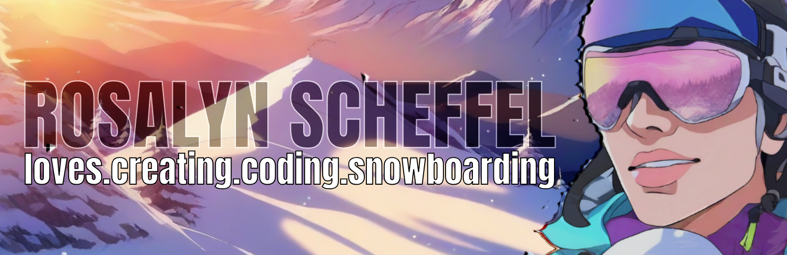

# About Me
<!-- banner -->

<!-- about me -->
* associate's in graphic design
* certificate in full stack web development

<!-- skills -->
## 🔧Technologies & Tools

<!-- programming language -->
## Languages

<!-- socials/contact -->

### 📬Contact Me:

<!--  -->
<!-- 
 -->
<!--  -->
<!--  -->

<!-- **RosalynS78/RosalynS78** is a ✨ _special_ ✨ repository because its `README.md` (this file) appears on your GitHub profile.

Here are some ideas to get you started:

- 🔭 I’m currently working on ...
- 🌱 I’m currently learning ...
- 👯 I’m looking to collaborate on ...
- 🤔 I’m looking for help with ...
- 💬 Ask me about ...
- 📫 How to reach me: ...
- 😄 Pronouns: ...
- ⚡ Fun fact: ...
-->
